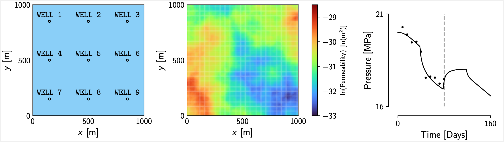

# Ensemble Methods: a Benchmark Study



This repository contains code written to provide a comparison between the posterior distributions generated by several methods for approximate Bayesian inference, and the posterior characterised using Markov chain Monte Carlo (an exact sampling method), for a high-dimensional nonlinear inverse problem.

In particular, we consider the problem of estimating the spatially varying log-permeability field (parametrised using a Gaussian random field with a Whittle-Matérn covariance function) of a two-dimensional single-phase oil reservoir, using noisy pressure measurements recorded at a set of production wells. 
The figure at the top of the document shows the locations of the production wells, the log-permeability of the reservoir, and the pressure at well 8 (the black line denotes the true pressure and the dots denote the noisy observations).

The benchmark posterior is generated using the preconditioned Crank-Nicolson MCMC sampler [[1](#1)]. 
These results can then be compared to the approximations of the posterior generated using a number of approximate methods, including ensemble randomised maximum likelihood [[2](#2)], ensemble Kalman inversion [[3](#3), [4](#4)], and the ensemble Kalman sampler [[5](#5), [6](#6)].

It may not be straightforward to adapt the implementations of the algorithms in this repository to work with different forward problems. 
If you are interested in applying ensemble methods in a different context, you might like to check out [EnsembleKalmanProcesses.jl](https://github.com/clima/ensemblekalmanprocesses.jl), which provides robust, model-independent implementations of a range of ensemble methods.

## Getting Started

First, install Julia >= 1.9.0.
Clone the repository, then create an environment with the project dependencies by running the following in the Julia REPL:
```
using Pkg
Pkg.activate(".")
Pkg.instantiate()
```
You should then be able to run any of the scripts in the top level of the repository.

## References

[<a id="1">1</a>]
Cotter, SL, Roberts, GO, Stuart, AM, and White, D (2013).
MCMC methods for functions: Modifying old algorithms to make them faster.
*Statistical Science* **28**, 424-446.

[<a id="2">2</a>]
Chen, Y and Oliver, DS (2013). 
Levenberg–Marquardt forms of the iterative ensemble smoother for efficient history matching and uncertainty quantification.
*Computational Geosciences* **17**, 689–703.

[<a id="3">3</a>]
Iglesias, MA, Law, KJ, and Stuart, AM (2013).
Ensemble Kalman methods for inverse problems.
*Inverse Problems* **29**, 045001.

[<a id="4">4</a>]
Iglesias, M and Yang, Y (2021). 
Adaptive regularisation for ensemble Kalman inversion.
*Inverse Problems* **37**, 025008.

[<a id="5">5</a>]
Garbuno-Inigo, A, Hoffmann, F, Li, W, and Stuart, AM (2020).
Interacting Langevin diffusions: Gradient structure and ensemble Kalman sampler. 
*SIAM Journal on Applied Dynamical Systems* **19**, 412-441.

[<a id="6">6</a>]
Garbuno-Inigo, A, Nüsken, N, and Reich, S (2020). 
Affine invariant interacting Langevin dynamics for Bayesian inference. 
*SIAM Journal on Applied Dynamical Systems* **19**, 1633-1658.
